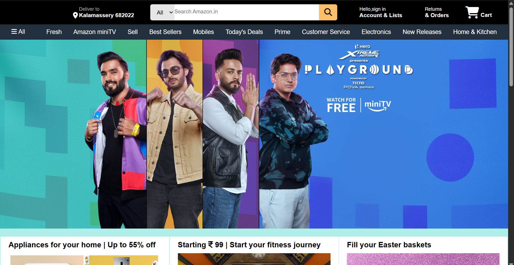
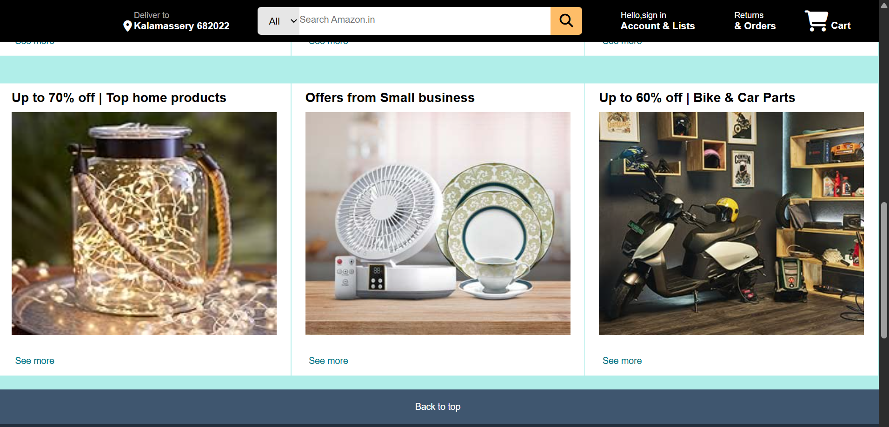

# Amazon Clone
A static clone of the Amazon.in homepage created using **HTML** and **CSS**.

## Features
- **Header:** Amazon logo, search bar (non-functional), account links, and cart icon.
- **Navigation Bar:** Category links similar to Amazon.
- **Hero Section:** Static banner images.
- **Product Grids:** Multiple product category sections.
- **Footer:** Links and info similar to Amazon.

## Screenshots





## Technologies Used
- HTML5
- CSS3

## How to Run
1. Clone the repository:
   ```bash
   git clone https://github.com/your-username/amazon-clone.git
